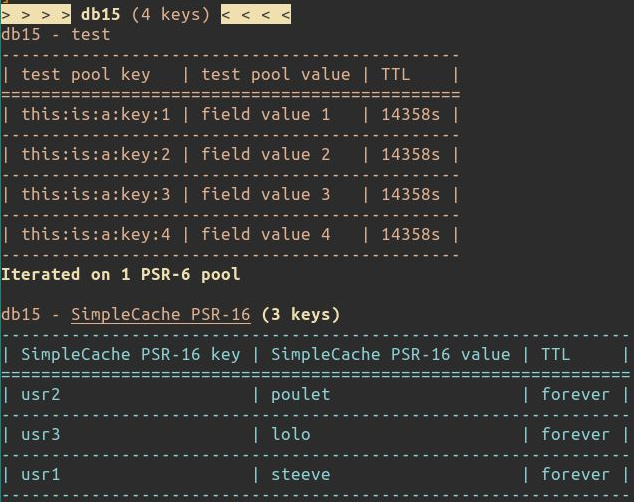

# RedisTools
> 
This tool primary purpose is to pair with my own implementation of PSR-6 pools or PSR-16 Simple Cache:
](https://github.com/llegaz/RedisCache/actions)
> 

> 
## Notes:
> 
1. **This set of tools is not designed to debug real world scenario with millions entries !**  
In fact, it is a simple development tool to preview PSR-6 pools or PSR-16 Simple Cache while setting them up with, for instance, check on some fixtures, expiration and so on. 
2. There won't be any units here or at least not for now (I should reconsider this while achieving point 3). 
3. Try to enhance these Tools to be usable in production (custom Lua batch scripts ? excluding O(n) complexity (HGETALL)). 

> 
> 
**See you space cowboy...** 🚀
